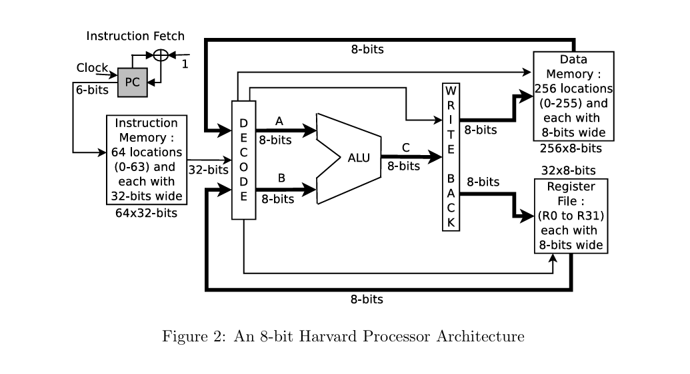

# Harvard Architecture 8-bit Processor Design

## Overview
This project implements a custom **8-bit Harvard Architecture Processor** designed with Verilog HDL. The processor features separate instruction and data memory spaces, a 32-entry register file, and a high-performance ALU optimized for fixed-point arithmetic and logical operations.

The design focuses on a single-cycle execution model where 32-bit instructions are fetched and processed to manipulate 8-bit data.

---

## Processor Architecture
The following diagram illustrates the data path and control flow of the 8-bit Harvard Processor, featuring the separate memory buses and the central ALU.

---

## Processor Specifications
| Feature | Specification |
| :--- | :--- |
| **Architecture** | Harvard Architecture (Separate Bus for Instructions/Data) |
| **Data Width** | 8-bit |
| **Instruction Width** | 32-bit |
| **Register File** | 32 General Purpose 8-bit Registers (R0 to R31) |
| **Instruction Memory** | 64 locations (64 x 32-bits) |
| **Data Memory** | 256 locations (256 x 8-bits) |
| **Program Counter** | 6-bit |

---

## Modular Components
The processor consists of several modular blocks integrated to form the Harvard pipeline:

* **Program Counter (PC):** A 6-bit register that generates addresses for the instruction memory.
* **Instruction Memory:** Stores the 32-bit wide program instructions.
* **Decode Unit:** Processes the opcode to generate control signals and identifies operand registers.
* **Register File:** Provides high-speed storage for 8-bit intermediate operands (R0 to R31).
* **ALU (Execution Unit):** Performs arithmetic, logic, and shift operations.
* **Data Memory:** Handles Load and Store operations for persistent data storage.
* **Write Back Unit:** Ensures computation results are retired correctly to the register file.

---

## ALU Design Features
The ALU is the core of the processor and implements specific high-performance hardware algorithms:

* **Fixed Point Adder/Subtractor:** Uses an 8-bit Carry Lookahead Adder (CLA) utilizing KGP blocks and a **Recursive Doubling algorithm**. Subtraction is handled via 2's complement logic.
* **Fixed Point Multiplier:** Implemented as an 8-bit **Wallace Tree** or Carry Save Array multiplier using carry-save-adders.
* **Shifter Unit:** An 8-bit Barrel or Logarithmic shifter supporting both logical left and right shifts.
* **Logic Unit:** Executes bitwise NOT, AND, OR, NAND, NOR, XOR, and XNOR operations.

---

## Instruction Set Architecture (ISA)
The processor supports five distinct instruction formats to handle various operations:

### Instruction Formats
1. **Immediate Move:** `Opcode(6) | Rdst(5) | Unused(13) | Immediate Value(8)`
2. **Register Move:** `Opcode(6) | Rdst(5) | Unused(16) | Rsrc(5)`
3. **Load:** `Opcode(6) | Rdst(5) | Unused(13) | Src Address(8)`
4. **Store:** `Opcode(6) | Dst Address(8) | Unused(13) | Rsrc(5)`
5. **Arithmetic/Logic:** `Opcode(6) | Rdst2(5) | Rdst1(5) | Unused(6) | Rsrc2(5) | Rsrc1(5)`

## Instruction Set Architecture (ISA) & Opcode Encoding
The processor supports a 6-bit opcode system with five distinct instruction formats.

| Opcode | Mnemonic | Usage | Operation | Description |
| :--- | :--- | :--- | :--- | :--- |
| `000000` | **MOV** | `MOV Rdst, #Imm` | $Rdst \leftarrow Imm$ | Move 8-bit immediate value to register. |
| `000001` | **MOV** | `MOV Rdst, Rsrc` | $Rdst \leftarrow Rsrc$ | Move value from source register to destination. |
| `000010` | **LOAD** | `LOAD Rdst, [Addr]` | $Rdst \leftarrow Mem[Addr]$ | Load data from memory address to register. |
| `000011` | **STORE** | `STORE [Addr], Rsrc` | $Mem[Addr] \leftarrow Rsrc$ | Store register value into data memory. |
| `000100` | **ADD** | `ADD Rdst1, Rsrc2, Rsrc1` | $Rdst1 \leftarrow Rsrc2 + Rsrc1$ | 8-bit fixed-point addition. |
| `000101` | **SUB** | `SUB Rdst1, Rsrc2, Rsrc1` | $Rdst1 \leftarrow Rsrc2 - Rsrc1$ | 8-bit fixed-point subtraction. |
| `000110` | **NEG** | `NEG Rdst1, Rsrc1` | $Rdst1 \leftarrow -Rsrc1$ | 2's complement negation. |
| `000111` | **MUL** | `MUL Rdst2, Rdst1, Rsrc2, Rsrc1` | $\{Rdst2, Rdst1\} \leftarrow Rsrc2 \times Rsrc1$ | 8-bit multiplication (16-bit result). |
| `001000` | **DIV** | `DIV Rdst1, Rsrc2, Rsrc1` | $Rdst1 \leftarrow Rsrc2 / Rsrc1$ | 8-bit fixed-point hardware division. |
| `001001` | **OR** | `OR Rdst1, Rsrc2, Rsrc1` | $Rdst1 \leftarrow Rsrc2 \mid Rsrc1$ | Bitwise Logical OR. |
| `001010` | **XOR** | `XOR Rdst1, Rsrc2, Rsrc1` | $Rdst1 \leftarrow Rsrc2 \oplus Rsrc1$ | Bitwise Logical XOR. |
| `001011` | **NAND** | `NAND Rdst1, Rsrc2, Rsrc1` | Rdst1 = ~(Rsrc2 & Rsrc1) | Bitwise Logical NAND. |
| `001100` | **NOR** | `NOR Rdst1, Rsrc2, Rsrc1` | $Rdst1 \leftarrow \neg(Rsrc2 \mid Rsrc1)$ | Bitwise Logical NOR. |
| `001101` | **XNOR** | `XNOR Rdst1, Rsrc2, Rsrc1` | $Rdst1 \leftarrow \neg(Rsrc2 \oplus Rsrc1)$ | Bitwise Logical XNOR. |
| `001110` | **NOT** | `NOT Rdst1, Rsrc1` | $Rdst1 \leftarrow \neg Rsrc1$ | Bitwise Logical NOT. |
| `001111` | **LLSH** | `LLSH Rdst1, Rsrc2, Rsrc1` | $Rdst1 \leftarrow Rsrc2 \ll Rsrc1$ | Logical Left Shift. |
| `010000` | **LRSH** | `LRSH Rdst1, Rsrc2, Rsrc1` | $Rdst1 \leftarrow Rsrc2 \gg Rsrc1$ | Logical Right Shift. |

---

## Future Extensions
* **Pipelining:** Implementing a multi-stage pipeline to increase throughput.
* **Branching Logic:** Adding Jump (JMP) and Conditional Branch (BEQ, BNE) instructions to support complex program flow.
* **Interrupt Handling:** Integrating a basic interrupt controller for asynchronous hardware communication.
* **FPGA Implementation:** Porting the Verilog RTL to Xilinx or Altera FPGAs for hardware validation.

## Author
**Raghul Dharani Raj**
* ECE Student
* Interests: Digital VLSI Design, Processor Architecture, and FPGA Design Flow.
